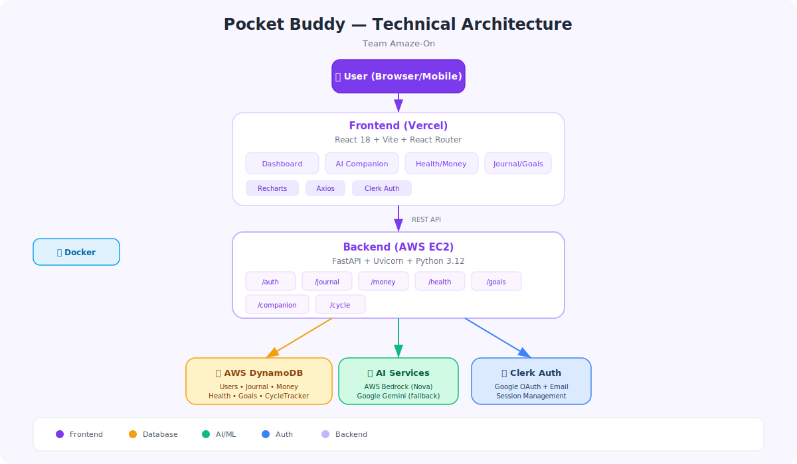

# Pocket Buddy 💜

> Your AI-powered personal life companion for students and young professionals.

---

## 🎯 Problem We're Solving

Students and young professionals juggle **finances, health, mental wellness, and goals** across multiple disconnected apps. There's no single place that understands them holistically — and no one to talk to at 2 AM when stressed about money or health.

**Pocket Buddy** solves this by combining life tracking with a personalized AI best friend that knows your context, automatically saves data from conversations, and proactively supports your well-being.

---

## 💡 How We Solve It

- **One unified dashboard** — Budget, spending, health, sleep, goals, and mood in one view
- **AI Companion** — A named AI best friend (you choose the name!) that can chat naturally AND automatically save data you mention ("I spent ₹200 on lunch" → automatically logs expense)
- **Smart tracking** — Journal with mood analysis, expense categorization, health habits, goal progress, and menstrual cycle predictions
- **Zero effort** — Just talk to your AI friend; it handles the rest

---

## 🏗️ How It's Built



| Layer | Technology |
|-------|-----------|
| Frontend (what you see on screen) | React 18 (UI library), Vite (build tool), React Router (page navigation), Recharts (charts), Axios (API calls) |
| Login & Authentication | Clerk (handles Google sign-in and email/password login) |
| Backend (server logic) | FastAPI (a Python web framework), Uvicorn (a lightweight server runner) |
| Database (data storage) | AWS DynamoDB (a cloud-hosted NoSQL database with 6 tables) |
| AI (smart features) | AWS Bedrock Nova Lite/Micro (Amazon's AI models), Google Gemini (backup AI) |
| Hosting | Vercel (hosts the frontend), AWS EC2 (hosts the backend server) |
| Local packaging (run everything together) | Docker + docker-compose (bundles the app so it runs anywhere) |

---

## 🚀 Live Demo

- **App:** [amaze-on.vercel.app](https://amaze-on-vanessas-projects-583e2db4.vercel.app)
- **Server:** Hosted on AWS

---

## 🖥️ Run It on Your Computer

### What You Need First

- Python 3.12 or newer
- Node.js 20 or newer
- AWS credentials (to connect to the database)
- A Clerk account key (used for login)
- A Gemini API key (for the AI companion)

### 1. Clone the repo (download the code)

```bash
git clone https://github.com/vanessaashrie/Amaze-On.git
cd Amaze-On
```

### 2. Set Up the Server

```bash
cd backend
pip install -r requirements.txt
```

Create a file called `backend/.env` and add:
```
AWS_REGION=eu-north-1
AWS_ACCESS_KEY_ID=your_key
AWS_SECRET_ACCESS_KEY=your_secret
GEMINI_API_KEY=your_gemini_key
```

Start the server:
```bash
uvicorn main:app --reload --port 8000
```

### 3. Set Up the App

```bash
cd frontend
npm install
```

Create a file called `frontend/.env` and add:
```
VITE_CLERK_PUBLISHABLE_KEY=your_clerk_key
VITE_BACKEND_URL=http://localhost:8000
VITE_API_URL=http://localhost:8000
```

Start the website:
```bash
npm run dev
```

### 4. Or use Docker (runs everything in one command)

```bash
docker-compose up
```
- Backend: http://localhost:8000
- Frontend: http://localhost:5173

---

## ✨ Features

| Feature | Description |
|---------|-------------|
| 🤖 AI Companion | Named AI best friend that chats, motivates, and automatically saves data you mention |
| 💰 Money Tracker | Track money in and out, grouped by category, with charts |
| ❤️ Health Tracker | Sleep, steps, water, heart rate, BMI (body mass index), daily habits |
| 📓 Journal | Write diary entries with mood labels and history |
| 🎯 Goals | Set, track, and complete goals across categories |
| 🩸 Cycle Tracker | Period logging with next cycle & fertility predictions |
| 📊 Reports | Monthly wellness score, spending vs saving trends, AI insights |
| 📱 Works on all screen sizes | Desktop, tablet, and mobile |
| 🌙 Dark Mode | Stays on even after you close the app |

---

## 📡 API Reference (for developers)

| Method | Endpoint | What It Does |
|--------|----------|-------------|
| POST | `/auth/onboarding` | Save user profile during sign-up |
| GET | `/auth/profile/{id}` | Get a user's saved profile |
| POST | `/journal/` | Create a new journal entry |
| GET | `/journal/{id}` | Get all journal entries for a user |
| POST | `/money/` | Add a new income or expense |
| GET | `/money/{id}` | Get all transactions for a user |
| POST | `/health/` | Log health data (sleep, steps, etc.) |
| GET | `/health/{id}` | Get health logs for a user |
| GET | `/health/{id}/today` | Get today's health log |
| POST | `/goals/` | Create a new goal |
| GET | `/goals/{id}` | Get all goals for a user |
| PATCH | `/goals/update` | Update a goal's progress |
| POST | `/cycle/log` | Log a period entry |
| GET | `/cycle/{id}` | Get cycle history + predicted dates |
| POST | `/companion/chat` | Send a message to the AI companion |

---

## 🗄️ How Data is Stored

Each table stores a different type of user data in AWS DynamoDB (a cloud database):

| Table | Main Key | Sort Key |
|-------|----------|----------|
| AmazeOnUsers | userId | — |
| JournalEntries | userId | entry_id |
| Money | userId | transaction_id |
| Health | userId | date |
| Goals | userId | goal_id |
| CycleTracker | userId | period_id |

---

## 📂 Project Structure (How Files Are Organized)

```
├── backend/
│   ├── main.py                 # Server starting point
│   ├── routes/                 # Handles requests for each feature
│   │   ├── auth.py             # New user setup & profile
│   │   ├── companion.py        # AI chat + automatic data saving
│   │   ├── journal.py          # Create, read, update, delete journal entries
│   │   ├── money.py            # Transactions
│   │   ├── health.py           # Health logs
│   │   ├── goals.py            # Create, read, update, delete goals
│   │   └── cycle.py            # Menstrual cycle tracker
│   ├── models/                 # Data format definitions
│   ├── services/dynamodb.py    # All database read/write operations
│   └── requirements.txt
├── frontend/
│   ├── src/
│   │   ├── pages/              # Each screen of the app
│   │   ├── components/         # Sidebar, TopBar, Layout, Theme
│   │   ├── hooks/              # Detects screen size for layout
│   │   └── api.js              # Handles all server communication
│   └── package.json
├── docker-compose.yml
└── architecture.svg
```

---

## 👥 Team

Built with 💜 by **Team Amaze-On**
